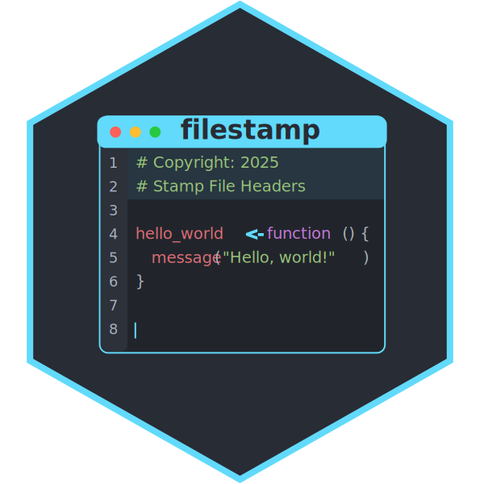

<!-- README.md is generated from README.Rmd. Please edit that file -->

```{r, include = FALSE}
knitr::opts_chunk$set(
  collapse = TRUE,
  comment = "#>",
  fig.path = "man/figures/README-",
  out.width = "100%"
)
```

# filestamp  

<!-- badges: start -->
[](https://github.com/coatless-rpkg/filestamp/actions/workflows/R-CMD-check.yaml)
<!-- badges: end -->

`filestamp` makes it easy to add and maintain consistent headers across all files in your project, regardless of programming language. Headers can include copyright notices, file descriptions, authorship information, and other metadata.

### What are file headers?

File headers are structured comments at the beginning of code files that contain important metadata. For example, a header might include:

```r
# Copyright (c) Acme Corp 2025
# Author: Jane Developer
# License: MIT
# Last updated: 2025-04-21
```

## Installation

You can install the development version of `filestamp` from [GitHub][filestamp-gh] with:

```{r}
#| label: setup
#| eval: false
# install.packages("remotes")

# From GitHub
remotes::install_github("coatless-rpkg/filestamp")
```

## Getting Started

This section provides a few examples of how to use `filestamp` to add headers to your files. For more detailed information, please refer to the package documentation.

### Loading the Package

To use `filestamp`, you first need to load the package using the `library()` function. This will make all the functions and features of `filestamp` available for use in your R session.

```{r}
#| label: setup-usage
library(filestamp)
```

### Stamping a Single File

You can use the `stamp_file()` function to add a header to a single file. The function takes the file path as an argument and can also accept a template name or a custom template.

```{r}
#| label: add-headers
#| eval: false

# Stamp a file with the default template
stamp_file("script.R")

# Stamp a file with a specific template
stamp_file("script.py", template = "mit")

# Preview changes without modifying the file
stamp_file("script.R", action = "dryrun")

# Create a backup before stamping
stamp_file("important_script.R", action = "backup")
```


### Stamping a Directory with Multiple Files

You can use the `stamp_dir()` function to add headers to all files in a directory. You can specify a pattern to match specific file types, and you can also choose to stamp files in subdirectories.

```{r}
#| label: stamp-dir
#| eval: false
# Stamp all R files in a directory
stamp_dir("src", pattern = "\\.R$")

# Stamp all files in a directory and subdirectories
stamp_dir("project", recursive = TRUE)

# Stamp with a specific template
stamp_dir("src", template = "gpl-3")
```

## Templates

### Using Built-in Templates

The package comes with several built-in templates:

- `default` - A simple header with copyright, author, and license information
- `mit` - MIT License header
- `gpl-3` - GNU General Public License header
- `agpl-3` - GNU Affero General Public License header

List available templates:


```{r}
#| label: stamp-templates
stamp_templates()
```

### Creating Custom Templates

You can create your own custom templates using the `stamp_template_create()` function. This allows you to define the fields and content of the header.

```{r}
#| label: custom-template
#| eval: false
# Create a custom template
my_template <- stamp_template_create(
  name = "my_custom",
  fields = stamp_template_describe(
    copyright = stamp_template_field("copyright", "MyCompany 2025", required = TRUE),
    author = stamp_template_field("author", "John Doe", required = TRUE)
  ),
  content = stamp_template_content(
    "Copyright (c) {{copyright}}",
    "Created by: {{author}}",
    "File: {{filename}}"
  )
)

# Use the custom template
stamp_file("script.R", template = my_template)
```

## Updating Existing Headers

You can update existing headers in files using the `stamp_update()` function. This is useful for changing copyright years, adding new authors, or modifying other metadata.

> [!IMPORTANT]
>
> Make sure to use the `stamp_update()` function carefully, as it will modify existing files. Always create backups before making changes.
>
> Some helper functions may not work as expected if the file does not contain a header
> or if the header is not in the expected format.

```{r}
#| label: existing-header
#| eval: false
# Update copyright years in existing headers
stamp_update("old_script.R", list(
  copyright = stamp_update_helper_copyright_extend()
))

# Add a new author to existing headers
stamp_update("collaborative_script.R", list(
  author = stamp_update_helper_author_add("Jane Smith")
))
```

## Language Support

`filestamp` supports 15+ programming languages out of the box:

```{r}
#| label: languages
#| eval: false
# List all supported languages
languages()
```

Add support for additional languages:

```{r}
#| label: custom-language
#| eval: false
# Register a new language
language_register(
  "kotlin",
  extensions = c("kt", "kts"),
  comment_single = "//",
  comment_multi_start = "/*",
  comment_multi_end = "*/"
)
```

## Variables

Customize your headers with built-in and custom variables:

```{r}
#| label: stamp-template-variables
#| eval: false
# List available variables
stamp_variables_list()

# Add a custom variable
stamp_variables_add("team", "Data Science")

# Set company name globally
options(filestamp.company = "Acme Corp")
```

Built-in variables include:

- `{{year}}` - Current year
- `{{date}}` - Current date (YYYY-MM-DD)
- `{{date_full}}` - Full timestamp
- `{{user}}` - Current username
- `{{company}}` - Company name from options
- `{{filename}}` - Current file name
- `{{file_ext}}` - File extension

## License

AGPL (>= 3)

[filestamp-gh]: https://github.com/coatless-rpkg/filestamp
