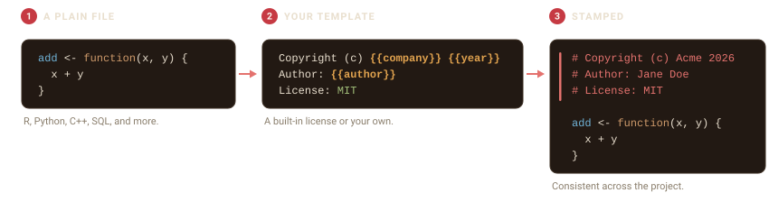

# Get started with filestamp

filestamp adds and maintains a consistent header at the top of your
source files, in whatever comment style each language uses. You pick a
template, point filestamp at a file or a directory, and it writes the
header for you.



## Stamp a single file

[`stamp_file()`](https://r-pkg.thecoatlessprofessor.com/filestamp/reference/stamp_file.md)
writes a header to the top of one file. Here is a small R script with no
header:

``` r

script <- tempfile(fileext = ".R")
writeLines(c("add <- function(x, y) {", "  x + y", "}"), script)
```

Stamp it with the default template:

``` r

stamp_file(script, author = "Jane Doe")
```

``` r

cat(readLines(script), sep = "\n")
#> # Copyright (c) Acme Corp 2026
#> # Author: Jane Doe
#> # License: All rights reserved.
#> # Last updated: 2026-07-18 06:02:57
#> 
#> add <- function(x, y) {
#>   x + y
#> }
```

The header is inserted at the top, in R’s `#` comment style, and your
code is left untouched below it.

### Preview before you write

Pass `action = "dryrun"` to see the header without changing the file.
The result prints where the header would go and how the file would be
written:

``` r

preview <- tempfile(fileext = ".R")
writeLines("y <- 2", preview)
stamp_file(preview, template = "mit", action = "dryrun")
```

### Keep a backup

`action = "backup"` copies the file to `<name>.bck` before stamping, so
you always have the original:

``` r

safe <- tempfile(fileext = ".R")
writeLines("z <- 3", safe)
stamp_file(safe, action = "backup", author = "Jane Doe")
file.exists(paste0(safe, ".bck"))
#> [1] TRUE
```

filestamp never re-stamps a file that already has a header, so running
it twice is safe.

## Stamp a whole directory

[`stamp_dir()`](https://r-pkg.thecoatlessprofessor.com/filestamp/reference/stamp_dir.md)
stamps every file it finds. Use `pattern` to match certain files and
`recursive = TRUE` to descend into subdirectories.


``` r

project <- file.path(tempdir(), "project")
dir.create(file.path(project, "R"), recursive = TRUE, showWarnings = FALSE)
writeLines("f <- function() 1", file.path(project, "R", "app.R"))
writeLines("def g(): pass",     file.path(project, "helpers.py"))
writeLines('{"name": "demo"}',  file.path(project, "config.json"))

result <- stamp_dir(project, author = "Jane Doe", recursive = TRUE)
#> Warning: Skipping '/tmp/Rtmpu6Sbew/project/config.json': unrecognized file type.
#> ℹ No language with a known comment syntax is registered for this extension.
```

The result records what happened to each file:

``` r

data.frame(
  file   = basename(vapply(result$results, `[[`, "", "file")),
  status = vapply(result$results, `[[`, "", "status")
)
#>          file  status
#> 1 config.json skipped
#> 2  helpers.py success
#> 3       app.R success
```

The `config.json` file is reported as **skipped**: JSON has no comment
syntax, so filestamp leaves it untouched instead of writing an invalid
header. This is a core promise: filestamp will not corrupt a file it
does not know how to comment. See
[`vignette("language-support")`](https://r-pkg.thecoatlessprofessor.com/filestamp/articles/language-support.md)
for how detection works.

## Where to next

- [`vignette("licenses-and-templates")`](https://r-pkg.thecoatlessprofessor.com/filestamp/articles/licenses-and-templates.md)
  covers the built-in license templates, custom templates, and
  variables.
- [`vignette("language-support")`](https://r-pkg.thecoatlessprofessor.com/filestamp/articles/language-support.md)
  covers the languages filestamp knows and how to add your own.
- [`vignette("maintaining-headers")`](https://r-pkg.thecoatlessprofessor.com/filestamp/articles/maintaining-headers.md)
  covers updating copyright years and authors in files that are already
  stamped.
