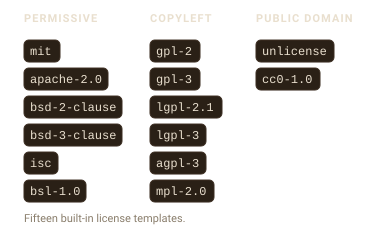

# Licenses and templates

A template decides what your header says. filestamp ships with templates
for the most common licenses, and you can write your own.

## Built-in license templates

filestamp includes fifteen license templates, grouped by how permissive
they are. Each one reproduces the canonical license text, with your
copyright and author filled in.



List them with
[`stamp_templates()`](https://r-pkg.thecoatlessprofessor.com/filestamp/reference/stamp_templates.md):

``` r

stamp_templates()
#>  [1] "agpl-3"       "apache-2.0"   "bsd-2-clause" "bsd-3-clause" "bsl-1.0"     
#>  [6] "cc0-1.0"      "default"      "gpl-2"        "gpl-3"        "isc"         
#> [11] "lgpl-2.1"     "lgpl-3"       "mit"          "mpl-2.0"      "unlicense"
```

Stamp a file with one by passing its name to `template`:

``` r

f <- tempfile(fileext = ".R")
writeLines("x <- 1", f)
stamp_file(f, template = "mit", author = "Jane Doe")
cat(readLines(f), sep = "\n")
#> # MIT License
#> # 
#> # Copyright (c) Acme Corp 2026
#> # 
#> # Permission is hereby granted, free of charge, to any person obtaining a copy
#> # of this software and associated documentation files (the "Software"), to deal
#> # in the Software without restriction, including without limitation the rights
#> # to use, copy, modify, merge, publish, distribute, sublicense, and/or sell
#> # copies of the Software, and to permit persons to whom the Software is
#> # furnished to do so, subject to the following conditions:
#> # 
#> # The above copyright notice and this permission notice shall be included in all
#> # copies or substantial portions of the Software.
#> # 
#> # THE SOFTWARE IS PROVIDED "AS IS", WITHOUT WARRANTY OF ANY KIND, EXPRESS OR
#> # IMPLIED, INCLUDING BUT NOT LIMITED TO THE WARRANTIES OF MERCHANTABILITY,
#> # FITNESS FOR A PARTICULAR PURPOSE AND NONINFRINGEMENT. IN NO EVENT SHALL THE
#> # AUTHORS OR COPYRIGHT HOLDERS BE LIABLE FOR ANY CLAIM, DAMAGES OR OTHER
#> # LIABILITY, WHETHER IN AN ACTION OF CONTRACT, TORT OR OTHERWISE, ARISING FROM,
#> # OUT OF OR IN CONNECTION WITH THE SOFTWARE OR THE USE OR OTHER DEALINGS IN THE
#> # SOFTWARE.
#> 
#> x <- 1
```

Copyleft licenses stamp the standard per-file notice rather than the
entire license text:

``` r

g <- tempfile(fileext = ".R")
writeLines("y <- 2", g)
stamp_file(g, template = "agpl-3", author = "Jane Doe")
cat(readLines(g), sep = "\n")
#> # Copyright (c) Acme Corp 2026
#> # Author: Jane Doe
#> # License: GNU Affero General Public License v3.0 or later
#> # 
#> # This program is free software: you can redistribute it and/or modify
#> # it under the terms of the GNU Affero General Public License as published
#> # by the Free Software Foundation, either version 3 of the License, or
#> # (at your option) any later version.
#> # 
#> # This program is distributed in the hope that it will be useful,
#> # but WITHOUT ANY WARRANTY; without even the implied warranty of
#> # MERCHANTABILITY or FITNESS FOR A PARTICULAR PURPOSE.  See the
#> # GNU Affero General Public License for more details.
#> # 
#> # You should have received a copy of the GNU Affero General Public License
#> # along with this program.  If not, see <https://www.gnu.org/licenses/>.
#> 
#> y <- 2
```

The `default` template is not a license; it is a simple copyright,
author, and license-line header for when you just want attribution.

## Custom templates

Build your own template with
[`stamp_template_create()`](https://r-pkg.thecoatlessprofessor.com/filestamp/reference/stamp_template_create.md).
A template has a name, a set of fields, and the content to render.
[`stamp_template_field()`](https://r-pkg.thecoatlessprofessor.com/filestamp/reference/stamp_template_field.md)
describes one field (its default value and whether it is required), and
[`stamp_template_content()`](https://r-pkg.thecoatlessprofessor.com/filestamp/reference/stamp_template_content.md)
holds the lines of the header.


``` r

team_header <- stamp_template_create(
  name = "team",
  fields = stamp_template_describe(
    copyright = stamp_template_field("copyright", "{{company}} {{year}}", required = TRUE),
    author    = stamp_template_field("author", "{{user}}", required = TRUE),
    team      = stamp_template_field("team", "Engineering", required = FALSE)
  ),
  content = stamp_template_content(
    "Copyright (c) {{copyright}}",
    "Author: {{author}}",
    "Team: {{team}}"
  )
)

f <- tempfile(fileext = ".R")
writeLines("x <- 1", f)
stamp_file(f, template = team_header, author = "Jane Doe")
cat(readLines(f), sep = "\n")
#> # Copyright (c) Acme Corp 2026Author: Jane DoeTeam: Engineering
#> 
#> x <- 1
```

## Variables

The `{...}` markers in a template are variables. filestamp fills them in
when it renders the header. Some are built in:

``` r

stamp_variables_list()
#> [1] "company"   "cwd"       "date"      "date_full" "file_ext"  "filename" 
#> [7] "user"      "year"
```

`{year}`, `{date}`, and `{date_full}` come from the current time;
`{user}` is your username; `{filename}` and `{file_ext}` come from the
file being stamped. `{company}` reads a global option, so you can set it
once:

``` r

options(filestamp.company = "Acme Corp")
```

Add your own variable with
[`stamp_variables_add()`](https://r-pkg.thecoatlessprofessor.com/filestamp/reference/stamp_variables_add.md).
It can be a fixed value or a function that is called for each file:

``` r

stamp_variables_add("team", "Data Science")

f <- tempfile(fileext = ".R")
writeLines("x <- 1", f)
tmpl <- stamp_template_create(
  name = "with_team",
  content = stamp_template_content("Team: {{team}}", "File: {{filename}}")
)
stamp_file(f, template = tmpl)
cat(readLines(f), sep = "\n")
#> # Team: Data ScienceFile: file1f1651e2051d.R
#> 
#> x <- 1
```

Any variable a template references but cannot resolve is left as-is, so
a typo shows up in the output as `{typo}` rather than silently
disappearing.
