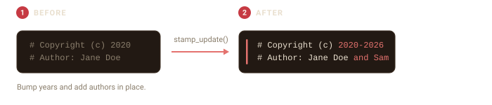
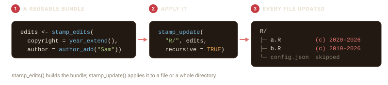

# Maintaining headers

Headers age. Copyright years roll over and contributors join.
[`stamp_update()`](https://r-pkg.thecoatlessprofessor.com/filestamp/reference/stamp_update.md)
edits an existing header in place, changing only the fields you name and
leaving the rest of the file alone.



## The common cases

Two verbs cover the everyday tasks. Here is a file with a header from a
few years ago:

``` r

f <- tempfile(fileext = ".R")
writeLines(c(
  "# Copyright (c) 2020",
  "# Author: Jane Doe",
  "",
  "x <- 1"
), f)
```

[`stamp_bump_year()`](https://r-pkg.thecoatlessprofessor.com/filestamp/reference/stamp_bump_year.md)
extends the copyright to the current year, keeping the owner and the
start year.
[`stamp_add_author()`](https://r-pkg.thecoatlessprofessor.com/filestamp/reference/stamp_add_author.md)
adds a contributor without duplicating anyone already listed:

``` r

stamp_bump_year(f)
stamp_add_author(f, "Sam Smith")
cat(readLines(f)[1:2], sep = "\n")
#> # Copyright (c) 2020-2026
#> # Author: Jane Doe and Sam Smith
```

Running either again is safe: the year is already current and Sam is
already listed, so nothing changes.

## Custom updates

For anything beyond those two,
[`stamp_update()`](https://r-pkg.thecoatlessprofessor.com/filestamp/reference/stamp_update.md)
takes named updates directly. Each value is a new value, or a function
of the field’s current value.
[`year_extend()`](https://r-pkg.thecoatlessprofessor.com/filestamp/reference/year_extend.md)
and
[`author_add()`](https://r-pkg.thecoatlessprofessor.com/filestamp/reference/author_add.md)
build those functions, and you can mix them with plain values in a
single call:

``` r

g <- tempfile(fileext = ".R")
writeLines(c(
  "# Copyright (c) 2018",
  "# Author: Ada Lovelace",
  "# License: GPL-2",
  "",
  "y <- 2"
), g)

stamp_update(g,
  copyright = year_extend(),
  author    = author_add("Sam Smith"),
  license   = "MIT"
)
cat(readLines(g)[1:3], sep = "\n")
#> # Copyright (c) 2018-2026
#> # Author: Ada Lovelace and Sam Smith
#> # License: MIT
```

## Reuse a set of edits across files

[`stamp_edits()`](https://r-pkg.thecoatlessprofessor.com/filestamp/reference/stamp_edits.md)
and
[`stamp_update()`](https://r-pkg.thecoatlessprofessor.com/filestamp/reference/stamp_update.md)
do different jobs.
[`stamp_edits()`](https://r-pkg.thecoatlessprofessor.com/filestamp/reference/stamp_edits.md)
builds a reusable *bundle* of changes and touches no files on its own.
[`stamp_update()`](https://r-pkg.thecoatlessprofessor.com/filestamp/reference/stamp_update.md)
is what *applies* changes to files, whether you pass them inline or as a
bundle.

Bundling pays off when you want the same set of edits applied in more
than one place. The bundle also prints what it will change:

``` r

edits <- stamp_edits(
  copyright = year_extend(),
  author    = author_add("Sam Smith")
)
edits
#> 
#> ── Header edits ──
#> 
#> • copyright: extend the copyright year
#> • author: add "Sam Smith"
```

## Update a whole directory

[`stamp_update()`](https://r-pkg.thecoatlessprofessor.com/filestamp/reference/stamp_update.md)
and the verbs accept a directory as well as a file. Given a directory,
they update every file that already has a header and leave the rest
alone. Use `recursive = TRUE` to include subdirectories.



``` r

project <- file.path(tempdir(), "project")
dir.create(file.path(project, "R"), recursive = TRUE, showWarnings = FALSE)
writeLines(c("# Copyright (c) 2020", "# Author: Jane Doe", "", "a <- 1"),
           file.path(project, "R", "a.R"))
writeLines(c("# Copyright (c) 2019", "# Author: Ada Lovelace", "", "b <- 2"),
           file.path(project, "R", "b.R"))

stamp_update(project, edits, recursive = TRUE)
```

Every stamped file in the tree now carries the new year and author, from
a single call.

## Preview and back up

Updating is editing, so the same `action` choices from stamping apply.
`action = "dryrun"` shows what would change without touching the file:

``` r

h <- tempfile(fileext = ".R")
writeLines(c("# Copyright (c) 2019", "# Author: Ada Lovelace", "", "y <- 2"), h)
stamp_bump_year(h, action = "dryrun")
#> 
#> ── Update Preview for: /tmp/RtmpGGe2Mm/file1f3442520186.R ──────────────────────
#> 
#> ── Updated fields: ──
#> 
#> • copyright: 2019-2026
#> • author: Ada Lovelace
#> 
#> ── Header location: ──
#> 
#> Lines 1 to 2
#> 
#> ── File properties: ──
#> 
#> • Encoding: UTF-8
#> • Line ending: LF
#> • Read-only: No
```

`action = "backup"` writes a `.bck` copy before editing.

## When a field is not there

The update functions only touch fields they can find. If you ask to
update a field the header does not contain, filestamp warns instead of
silently doing nothing, so a typo or a missing field does not pass
unnoticed:

``` r

k <- tempfile(fileext = ".R")
writeLines(c("# Copyright (c) 2021", "# Author: Grace Hopper", "", "z <- 3"), k)
stamp_update(k, license = "MIT")
#> Warning: Could not locate 1 requested field in the header of
#> '/tmp/RtmpGGe2Mm/file1f348815775.R'.
#> ! Not updated: license.
```

The file is left unchanged, because there was no license line to update.
Add one by re-stamping with a template that includes it, or edit the
file directly.
