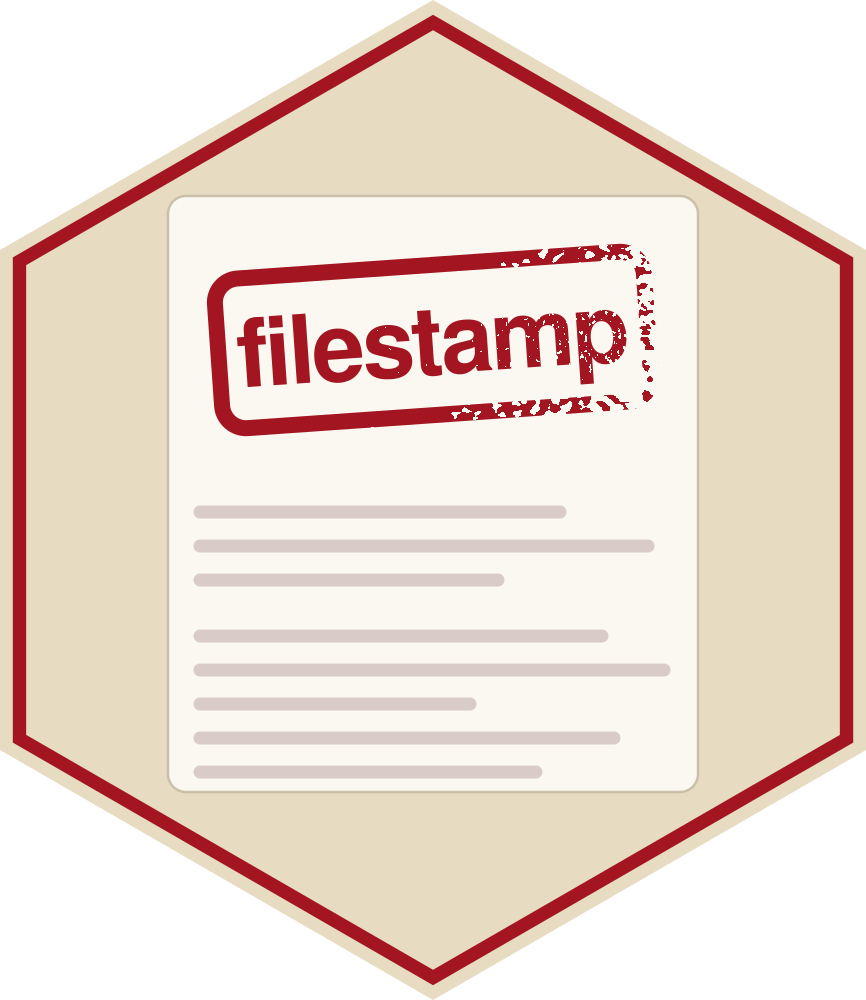

# filestamp 

`filestamp` makes it easy to add and maintain consistent headers across
all files in your project, regardless of programming language. Headers
can include copyright notices, file descriptions, authorship
information, and other metadata.


### What are file headers?

File headers are structured comments at the beginning of code files that
contain important metadata. For example, a header might include:

``` r

# Copyright (c) Acme Corp 2025
# Author: Jane Developer
# License: MIT
# Last updated: 2025-04-21
```

## Installation

You can install the development version of `filestamp` from
[GitHub](https://github.com/coatless-rpkg/filestamp) with:

``` r

# install.packages("remotes")

# From GitHub
remotes::install_github("coatless-rpkg/filestamp")
```

## Getting Started

This section provides a few examples of how to use `filestamp` to add
headers to your files. For more detailed information, please refer to
the package documentation.

### Loading the Package

To use `filestamp`, you first need to load the package using the
[`library()`](https://rdrr.io/r/base/library.html) function. This will
make all the functions and features of `filestamp` available for use in
your R session.

``` r

library(filestamp)
```

### Stamping a Single File

You can use the
[`stamp_file()`](https://r-pkg.thecoatlessprofessor.com/filestamp/reference/stamp_file.md)
function to add a header to a single file. The function takes the file
path as an argument and can also accept a template name or a custom
template.

``` r

# Stamp a file with the default template
stamp_file("script.R")

# Stamp a file with a specific template
stamp_file("script.py", template = "mit")

# Preview changes without modifying the file
stamp_file("script.R", action = "dryrun")

# Create a backup before stamping
stamp_file("important_script.R", action = "backup")
```

### Stamping a Directory with Multiple Files

You can use the
[`stamp_dir()`](https://r-pkg.thecoatlessprofessor.com/filestamp/reference/stamp_dir.md)
function to add headers to all files in a directory. You can specify a
pattern to match specific file types, and you can also choose to stamp
files in subdirectories.

``` r

# Stamp all R files in a directory
stamp_dir("src", pattern = "\\.R$")

# Stamp all files in a directory and subdirectories
stamp_dir("project", recursive = TRUE)

# Stamp with a specific template
stamp_dir("src", template = "gpl-3")
```

## Templates

### Using Built-in Templates

The package comes with built-in templates for the most common licenses,
each reproducing the canonical license text:

- `default` - A simple header with copyright, author, and license
  information
- Permissive: `mit`, `apache-2.0`, `bsd-2-clause`, `bsd-3-clause`,
  `isc`, `bsl-1.0`
- Copyleft: `gpl-2`, `gpl-3`, `lgpl-2.1`, `lgpl-3`, `agpl-3`, `mpl-2.0`
- Public domain: `unlicense`, `cc0-1.0`

List available templates:

``` r

stamp_templates()
#>  [1] "agpl-3"       "apache-2.0"   "bsd-2-clause" "bsd-3-clause" "bsl-1.0"     
#>  [6] "cc0-1.0"      "default"      "gpl-2"        "gpl-3"        "isc"         
#> [11] "lgpl-2.1"     "lgpl-3"       "mit"          "mpl-2.0"      "unlicense"
```

### Creating Custom Templates

You can create your own custom templates using the
[`stamp_template_create()`](https://r-pkg.thecoatlessprofessor.com/filestamp/reference/stamp_template_create.md)
function. This allows you to define the fields and content of the
header.

``` r

# Create a custom template
my_template <- stamp_template_create(
  name = "my_custom",
  fields = stamp_template_describe(
    copyright = stamp_template_field("copyright", "MyCompany 2025", required = TRUE),
    author = stamp_template_field("author", "John Doe", required = TRUE)
  ),
  content = stamp_template_content(
    "Copyright (c) {{copyright}}",
    "Created by: {{author}}",
    "File: {{filename}}"
  )
)

# Use the custom template
stamp_file("script.R", template = my_template)
```

## Updating Existing Headers

You can update existing headers in files using the
[`stamp_update()`](https://r-pkg.thecoatlessprofessor.com/filestamp/reference/stamp_update.md)
function. This is useful for changing copyright years, adding new
authors, or modifying other metadata.

> \[!IMPORTANT\]
>
> Make sure to use the
> [`stamp_update()`](https://r-pkg.thecoatlessprofessor.com/filestamp/reference/stamp_update.md)
> function carefully, as it will modify existing files. Always create
> backups before making changes.
>
> Some helper functions may not work as expected if the file does not
> contain a header or if the header is not in the expected format.

The two most common tasks have direct verbs:

``` r

# Bump the copyright year to the current year
stamp_bump_year("old_script.R")

# Add a new author
stamp_add_author("collaborative_script.R", "Jane Smith")
```

For anything else, pass named updates to
[`stamp_update()`](https://r-pkg.thecoatlessprofessor.com/filestamp/reference/stamp_update.md).
Each value is a new value or a function of the field’s current value:

``` r

stamp_update("script.R",
  copyright = year_extend(),        # extend the year, keep the owner
  author    = author_add("Jane Smith"),
  license   = "MIT"                 # or just set a value
)
```

Bundle a set of edits with
[`stamp_edits()`](https://r-pkg.thecoatlessprofessor.com/filestamp/reference/stamp_edits.md)
to reuse them, and point any update at a directory to apply it to every
stamped file at once:

``` r

edits <- stamp_edits(
  copyright = year_extend(),
  author    = author_add("Jane Smith")
)

# update every already-stamped file in the project
stamp_update("R/", edits, recursive = TRUE)
```

## Language Support

`filestamp` supports 15+ programming languages out of the box:

``` r

# List all supported languages
languages()
```

Add support for additional languages:

``` r

# Register a new language
language_register(
  "kotlin",
  extensions = c("kt", "kts"),
  comment_single = "//",
  comment_multi_start = "/*",
  comment_multi_end = "*/"
)
```

## Variables

Customize your headers with built-in and custom variables:

``` r

# List available variables
stamp_variables_list()

# Add a custom variable
stamp_variables_add("team", "Data Science")

# Set company name globally
options(filestamp.company = "Acme Corp")
```

Built-in variables include:

- `{{year}}` - Current year
- `{{date}}` - Current date (YYYY-MM-DD)
- `{{date_full}}` - Full timestamp
- `{{user}}` - Current username
- `{{company}}` - Company name from options
- `{{filename}}` - Current file name
- `{{file_ext}}` - File extension

## License

AGPL (\>= 3)
