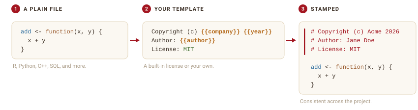
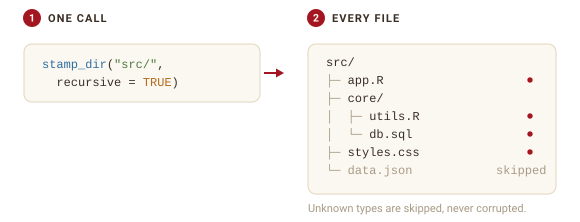
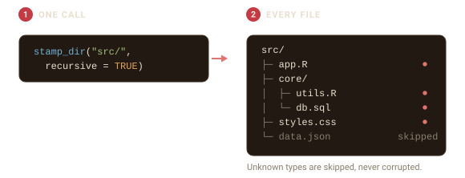

```{=html}
<style>
.fs-fig{display:block;margin:1.5rem auto;max-width:100%;height:auto}
.fs-dark{display:none}
@media (prefers-color-scheme:dark){.fs-light{display:none}.fs-dark{display:block}}
[data-bs-theme=light] .fs-light{display:block}
[data-bs-theme=light] .fs-dark{display:none}
[data-bs-theme=dark] .fs-light{display:none}
[data-bs-theme=dark] .fs-dark{display:block}
</style>
```

```{r setup}
#| include: false
library(filestamp)
options(filestamp.company = "Acme Corp")
```

filestamp adds and maintains a consistent header at the top of your source
files, in whatever comment style each language uses. You pick a template, point
filestamp at a file or a directory, and it writes the header for you.

{.fs-fig .fs-light}
{.fs-fig .fs-dark aria-hidden="true"}

## Stamp a single file

`stamp_file()` writes a header to the top of one file. Here is a small R
script with no header:

```{r}
script <- tempfile(fileext = ".R")
writeLines(c("add <- function(x, y) {", "  x + y", "}"), script)
```

Stamp it with the default template:

```{r}
#| message: false
stamp_file(script, author = "Jane Doe")
```

```{r}
cat(readLines(script), sep = "\n")
```

The header is inserted at the top, in R's `#` comment style, and your code is
left untouched below it.

### Preview before you write

Pass `action = "dryrun"` to see the header without changing the file. The
result prints where the header would go and how the file would be written:

```{r}
preview <- tempfile(fileext = ".R")
writeLines("y <- 2", preview)
stamp_file(preview, template = "mit", action = "dryrun")
```

### Keep a backup

`action = "backup"` copies the file to `<name>.bck` before stamping, so you
always have the original:

```{r}
#| message: false
safe <- tempfile(fileext = ".R")
writeLines("z <- 3", safe)
stamp_file(safe, action = "backup", author = "Jane Doe")
file.exists(paste0(safe, ".bck"))
```

filestamp never re-stamps a file that already has a header, so running it twice
is safe.

## Stamp a whole directory

`stamp_dir()` stamps every file it finds. Use `pattern` to match certain files
and `recursive = TRUE` to descend into subdirectories.

{.fs-fig .fs-light}
{.fs-fig .fs-dark aria-hidden="true"}

```{r}
#| message: false
project <- file.path(tempdir(), "project")
dir.create(file.path(project, "R"), recursive = TRUE, showWarnings = FALSE)
writeLines("f <- function() 1", file.path(project, "R", "app.R"))
writeLines("def g(): pass",     file.path(project, "helpers.py"))
writeLines('{"name": "demo"}',  file.path(project, "config.json"))

result <- stamp_dir(project, author = "Jane Doe", recursive = TRUE)
```

The result records what happened to each file:

```{r}
data.frame(
  file   = basename(vapply(result$results, `[[`, "", "file")),
  status = vapply(result$results, `[[`, "", "status")
)
```

The `config.json` file is reported as **skipped**: JSON has no comment syntax,
so filestamp leaves it untouched instead of writing an invalid header. This is a
core promise: filestamp will not corrupt a file it does not know how to comment.
See `vignette("language-support")` for how detection works.

## Where to next

- `vignette("licenses-and-templates")` covers the built-in license templates,
  custom templates, and variables.
- `vignette("language-support")` covers the languages filestamp knows and how
  to add your own.
- `vignette("maintaining-headers")` covers updating copyright years and authors
  in files that are already stamped.
