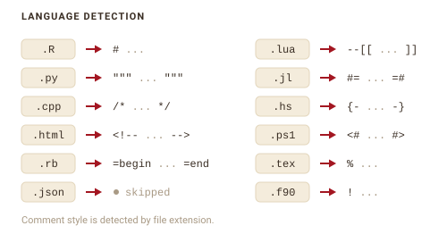
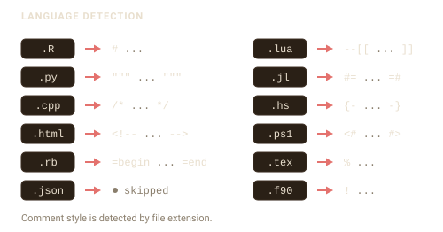

```{=html}
<style>
.fs-fig{display:block;margin:1.5rem auto;max-width:100%;height:auto}
.fs-dark{display:none}
@media (prefers-color-scheme:dark){.fs-light{display:none}.fs-dark{display:block}}
[data-bs-theme=light] .fs-light{display:block}
[data-bs-theme=light] .fs-dark{display:none}
[data-bs-theme=dark] .fs-light{display:none}
[data-bs-theme=dark] .fs-dark{display:block}
</style>
```

```{r setup}
#| include: false
library(filestamp)
options(filestamp.company = "Acme Corp")
```

filestamp works across languages by writing each header in the comment style
that language uses. It figures out the style from the file extension.

## How detection works

`detect_language()` maps a file's extension to a language definition. That
definition carries the comment markers filestamp uses when it formats the
header.

{.fs-fig .fs-light}
{.fs-fig .fs-dark aria-hidden="true"}

filestamp ships with definitions for many languages:

```{r}
length(languages())
```

The same template produces a different header depending on the file. A Python
file gets a triple-quoted block, while a C++ file gets a `/* */` block:

```{r}
#| message: false
py <- tempfile(fileext = ".py")
writeLines("def f(): pass", py)
stamp_file(py, template = "mit", author = "Jane Doe")
cat(head(readLines(py), 4), sep = "\n")
```

```{r}
#| message: false
cpp <- tempfile(fileext = ".cpp")
writeLines("int main() {}", cpp)
stamp_file(cpp, template = "mit", author = "Jane Doe")
cat(head(readLines(cpp), 4), sep = "\n")
```

## Files filestamp skips

When an extension is not recognized, `detect_language()` returns `NULL` and
filestamp skips the file rather than guessing. This keeps it from writing a
broken header. JSON is the clearest case: it has no comment syntax at all, so it
is always skipped.

Some extensions are shared by languages with different comment styles, and those
are skipped on purpose. `.m` belongs to Objective-C, MATLAB, and Mathematica;
`.cls` belongs to LaTeX, Salesforce Apex, and VBA. Guessing wrong would corrupt
the file, so filestamp declines:

```{r}
is.null(detect_language("model.m"))
is.null(detect_language("MyClass.cls"))
```

Objective-C is still supported through its unambiguous `.mm` extension, and
LaTeX through `.tex`, `.sty`, and `.Rnw`.

## Adding a language

Register a language filestamp does not know with `language_register()`. Give it
a name, the extensions it covers, and its comment markers. Use
`comment_multi_start` and `comment_multi_end` for languages with block comments:

```{r}
language_register(
  "coffeescript",
  extensions = "coffee",
  comment_single = "#",
  comment_multi_start = "###",
  comment_multi_end = "###"
)

detect_language("app.coffee")$name
```

Once registered, the language is available to every stamping function for the
rest of the session. To make it permanent, put the `language_register()` call in
your project startup, such as a `.Rprofile`.
