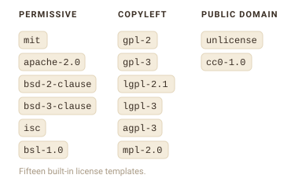
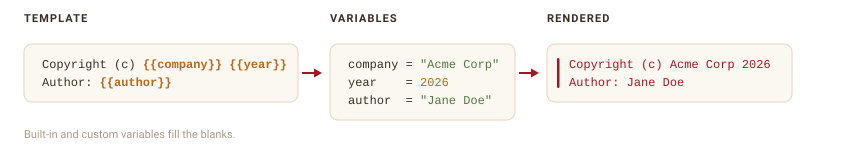
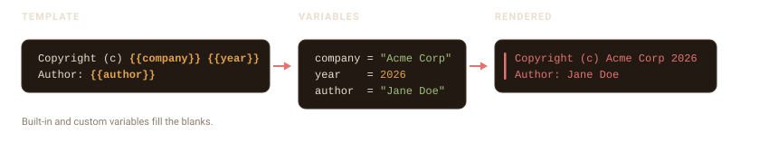

```{=html}
<style>
.fs-fig{display:block;margin:1.5rem auto;max-width:100%;height:auto}
.fs-dark{display:none}
@media (prefers-color-scheme:dark){.fs-light{display:none}.fs-dark{display:block}}
[data-bs-theme=light] .fs-light{display:block}
[data-bs-theme=light] .fs-dark{display:none}
[data-bs-theme=dark] .fs-light{display:none}
[data-bs-theme=dark] .fs-dark{display:block}
</style>
```

```{r setup}
#| include: false
library(filestamp)
options(filestamp.company = "Acme Corp")
```

A template decides what your header says. filestamp ships with templates for the
most common licenses, and you can write your own.

## Built-in license templates

filestamp includes fifteen license templates, grouped by how permissive they
are. Each one reproduces the canonical license text, with your copyright and
author filled in.

{.fs-fig .fs-light}
{.fs-fig .fs-dark aria-hidden="true"}

List them with `stamp_templates()`:

```{r}
stamp_templates()
```

Stamp a file with one by passing its name to `template`:

```{r}
#| message: false
f <- tempfile(fileext = ".R")
writeLines("x <- 1", f)
stamp_file(f, template = "mit", author = "Jane Doe")
cat(readLines(f), sep = "\n")
```

Copyleft licenses stamp the standard per-file notice rather than the entire
license text:

```{r}
#| message: false
g <- tempfile(fileext = ".R")
writeLines("y <- 2", g)
stamp_file(g, template = "agpl-3", author = "Jane Doe")
cat(readLines(g), sep = "\n")
```

The `default` template is not a license; it is a simple copyright, author, and
license-line header for when you just want attribution.

## Custom templates

Build your own template with `stamp_template_create()`. A template has a name,
a set of fields, and the content to render. `stamp_template_field()` describes
one field (its default value and whether it is required), and
`stamp_template_content()` holds the lines of the header.

{.fs-fig .fs-light}
{.fs-fig .fs-dark aria-hidden="true"}

```{r}
#| message: false
team_header <- stamp_template_create(
  name = "team",
  fields = stamp_template_describe(
    copyright = stamp_template_field("copyright", "{{company}} {{year}}", required = TRUE),
    author    = stamp_template_field("author", "{{user}}", required = TRUE),
    team      = stamp_template_field("team", "Engineering", required = FALSE)
  ),
  content = stamp_template_content(
    "Copyright (c) {{copyright}}",
    "Author: {{author}}",
    "Team: {{team}}"
  )
)

f <- tempfile(fileext = ".R")
writeLines("x <- 1", f)
stamp_file(f, template = team_header, author = "Jane Doe")
cat(readLines(f), sep = "\n")
```

## Variables

The `{{...}}` markers in a template are variables. filestamp fills them in when
it renders the header. Some are built in:

```{r}
stamp_variables_list()
```

`{{year}}`, `{{date}}`, and `{{date_full}}` come from the current time;
`{{user}}` is your username; `{{filename}}` and `{{file_ext}}` come from the
file being stamped. `{{company}}` reads a global option, so you can set it once:

```{r}
options(filestamp.company = "Acme Corp")
```

Add your own variable with `stamp_variables_add()`. It can be a fixed value or a
function that is called for each file:

```{r}
#| message: false
stamp_variables_add("team", "Data Science")

f <- tempfile(fileext = ".R")
writeLines("x <- 1", f)
tmpl <- stamp_template_create(
  name = "with_team",
  content = stamp_template_content("Team: {{team}}", "File: {{filename}}")
)
stamp_file(f, template = tmpl)
cat(readLines(f), sep = "\n")
```

Any variable a template references but cannot resolve is left as-is, so a typo
shows up in the output as `{{typo}}` rather than silently disappearing.
